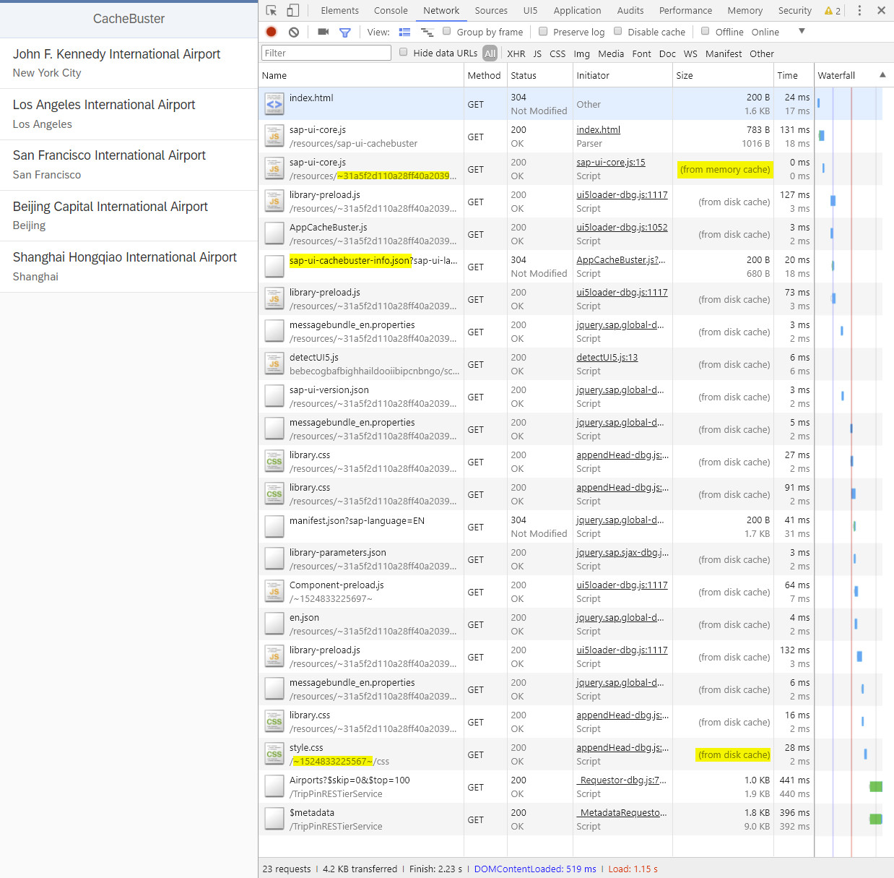

# CacheBuster

> This demo shows the usage of the UI5 CacheBuster in conjunction with the relevant build process to generate ```sap-ui-cachebuster-info.json```.

> Futhermore you will get a fully working local development environment that mimiks the SAP SCP platform to be able to run/build/deploy SCP projects locally or in CI / CD pipelines instead inside [WebIDE Full-Stack](https://www.sap.com/developer/tutorials/webide-grunt-basic.html).

## [OpenUI5 Developer Blog](http://openui5.blogspot.com/2018/04/cachebuster.html)

### [Online Demo (SAP HCP)](https://cachebuster-p1940953245trial.dispatcher.hanatrial.ondemand.com/index.html)



### Highlights
- app showing usage of UI5 [CacheBuster](https://openui5nightly.hana.ondemand.com/#/topic/ff7aceda0bd24039beb9bca8e882825d.html)
- SCP destination pointing out to northwind v4 example service [Northwind](http://services.odata.org/V4/Northwind/Northwind.svc/) 
- fix/workaround for linux post process bug [Fix #2312](https://github.com/SAPDocuments/Tutorials/issues/2312) inside Gruntfile.js
- including complete script for local ci server/build/deploy tasks

### CI Process 
- **develop** using your favorised IDE and test/preview using [localneo](https://www.npmjs.com/package/@uniorg/localneo) to have a local server proxy supporting neo-app.json and destinations 
- **build** using [grunt-sapui5-bestpractice-build](https://help.sap.com/viewer/825270ffffe74d9f988a0f0066ad59f0/CF/en-US/47045080ddaf414ba520d77353fc9441.html) plugin updated to version 1.3.50 with relevant task for generation of the **sap-ui-cachebuster-info.json** file 
- **deploy** to SCP by creating MTA using [MTA Archive builder](https://help.sap.com/viewer/58746c584026430a890170ac4d87d03b/Cloud/en-US/9f778dba93934a80a51166da3ec64a05.html) and deploy as described in the [CI Best Practices Guide](https://www.sap.com/developer/tutorials/ci-best-practices-fiori-sapcp.html)

### Prerequisites
- General Tasks
    - clone git project
    - install packages.json dependencies using ```npm install```
        - if you are using WebStorm / PHPStorm just RightClick on ```packages.json``` and choose ```Run 'npm install' ```
- Deployment Tasks   
    - download [MTA Archive builder](https://help.sap.com/viewer/58746c584026430a890170ac4d87d03b/Cloud/en-US/9f778dba93934a80a51166da3ec64a05.html) and extract to ```./ci/tools/mta.jar```
    - download [SAP Cloud Platform Neo Environment SDK](https://tools.hana.ondemand.com/#cloud) and extract to ```./ci/tools/neo-java-web-sdk/*```
    - add your scp account and user settings to ```./ci/deploy-mta.properties```
    - optionally you can enable your scp password in ```./ci/deploy-mta.bat``` to avoid password input request each deployment 
 
### Development Workflow
If you are using WebStorm / PHPStorm just RightClick on ```packages.json``` and choose ```Show npm Scripts``` to open window with all tasks located in left area.
- **develop** 
    - start local server using ```npm run serve``` to open the webapp folder [http://127.0.0.1:8080/webapp/index.html](http://127.0.0.1:8080/webapp/index.html) in the browser.
- **build** 
    - using ```npm run build``` or ```grunt``` to start the build process that generates ```/dist``` folder including ```Component-preload.js``` and ```sap-ui-cachebuster-info.json```.
- **test**
    - test builded app by opening [http://127.0.0.1:8080/dist/index.html](http://127.0.0.1:8080/webapp/index.html) productive/distributed version of the app.
- **deploy**
    - use deploy-mta script ```cd ci & deploy-mta``` to build and deploy app to scp
        - Initially a **cachebuster.mtar** (MultiTargetArchive) is generated using the **MTA Archive builder**.
        - Secondly the **cachebuster.mtar** file is deployed to SCP using **SAP Cloud Platform Neo Environment SDK**.

## License

Released under the [Apache license](http://www.apache.org/licenses/). Have at it.
